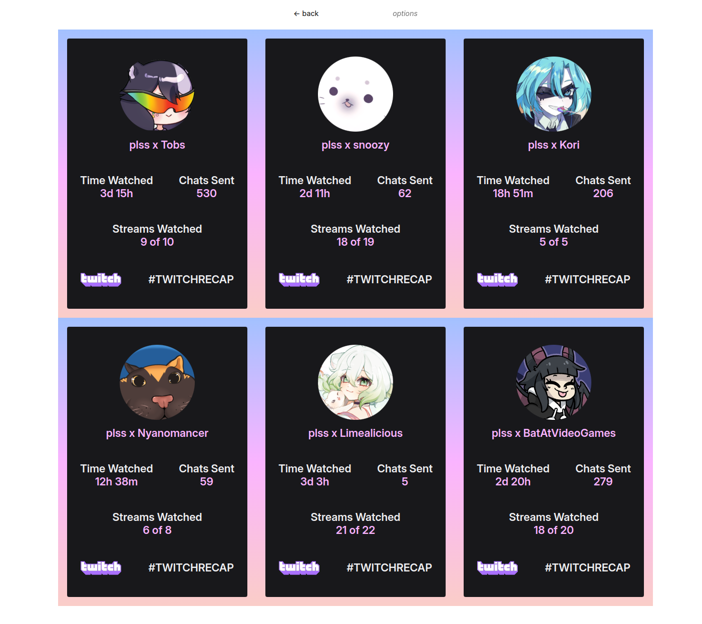

# tiles: tiled monthly twitch subscription recaps 

Uses Twitch's [**REDACTED**] API to collate all of your subscription recaps into
a single tiling grid layout:

> This DOES require you to copy-paste an OAuth token into the application - best
> I can do is promise I'm being very secure about it and purging them
> immediately after fetching the recaps. I also _swear_ that I'm not doing
> anything weird with them.
